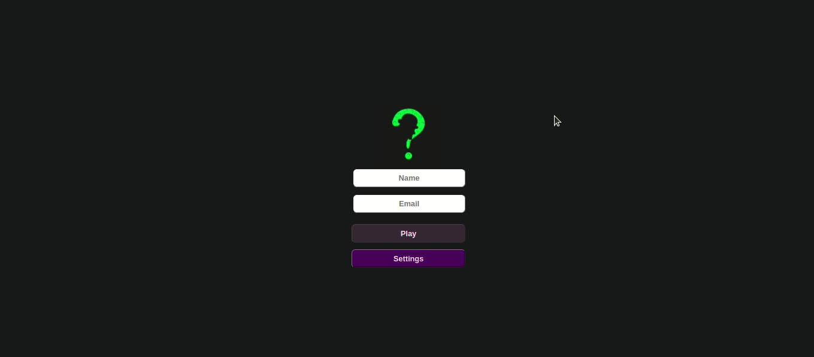

# TRIVIA ❓

Front-end Module project of [Trybe](https://www.betrybe.com/) course.

Project developed together with [Alector](https://github.com/AlectorAlexander) and [Jacqueline](https://github.com/Jacqueline-Silva)

It develops a Q&A game based on Trivia.

The user should be able to:
* Login and have their Gravatar image associated to her profile (if there is one) 
* Chose answers for the presented questions
* See the time to answer the question before it is considered wrong
* After 5 questions, be redirect to the score page, where the text shown depends on the hits number
* View the ranking page
---
🎯 **Objective**: put into practice the following abilities:
* Properly use `Redux` with `React`.

## 🛠️ **Used tools:**
* React
* Redux
* JSX
* Thunk
* CSS
* [Trivia API](https://opentdb.com/api_config.php)
* [Gravatar Image](https://br.gravatar.com/site/implement/images/)
---

### 🔗 Page Link
* [Trivia](https://queite.github.io/trivia/)

---

### 🔎 Project Preview

&nbsp;

All [Trybe](https://www.betrybe.com/) projects use `linters`, `Git` and `GitHub`.
 
Project tests carried on by Cypress. It was necessary to understand the tests in order to better meet the requirements.
